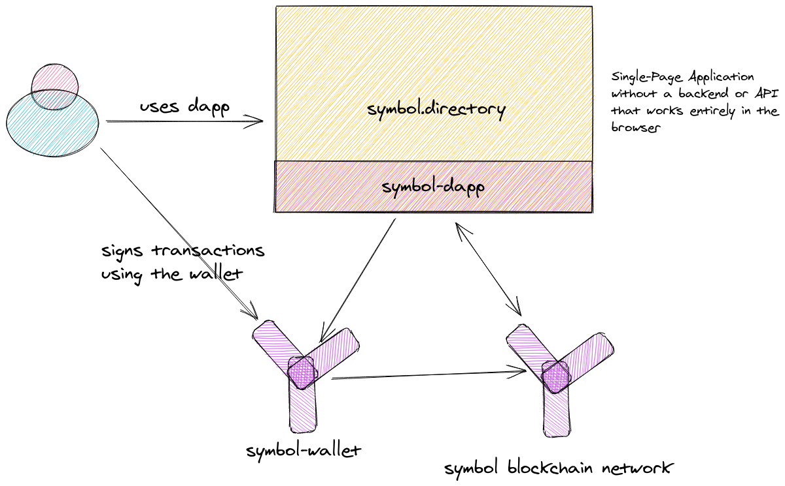
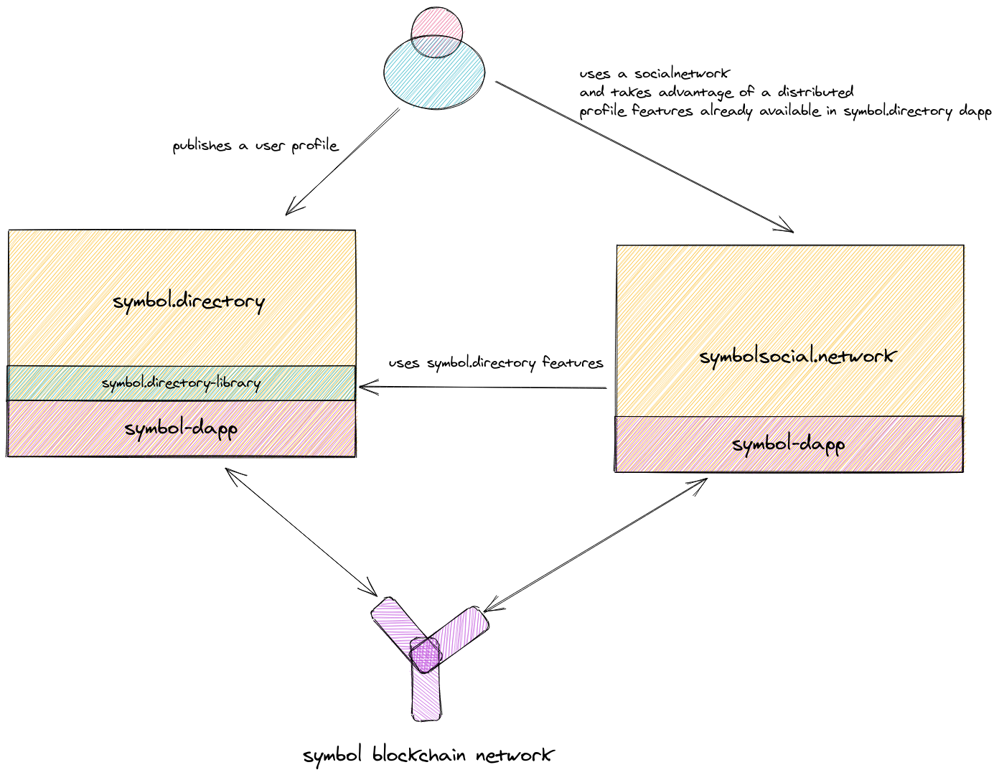

# Symbol-Dapp Framework Vision

> Boost the Dapp creation on the Symbol Ecosystem

## Mission

Enable developers to build Dapp applications faster to prove their business hypothesis.

## [Why do I do this? Check it here](./Why.md)

----

## How do we envision this?

### Milestone 1. _Enabling the Dapps creation_

Symbol-Dapp Framework is the root building block to build Symbol Dapps.

In order to create a Dapp in Symbol, we need three components with their own responsibilities:

- __Symbol Blockchain Network__. The source of truth.

The security and the source of truth always rely in the network. Symbol Dapp never will be able to override a core feature of the network.

- __Symbol Wallet__. The trust building block.

The main connector between Symbol Dapps and the users is the Symbol Wallet. It acts as trust point between which actions the users are performing in the Dapp and what's actually sent to the network.

- __Symbol Dapp Framework__. The technology enabler.

It acts as well defined building block on top of Symbol Network to build robust Symbol Dapps.

### Milestone 2. _Enabling composing Dapps_

When we start having multiple Dapps in Symbol, we expect that some uses cases be useful cross Dapps.

That's why one of the main core properties of Symbol Dapp Framework is __Composition__.

__It enables new Symbol Dapps build on top of other Symbol Dapps.__

## What does Symbol Dapp Framework means for businesses and entrepreneurs?

Symbol Dapp Framework enables:

- Rapid Experimentation
- Cheap Proof of Concepts
- Robust Minimum Viable Products

## What does Symbol Dapp Framework for Symbol Ecosystem?

- Higher Adoption of the technology
- Verify use cases in a cheap and safe way first, then implement a first layer transaction.

## What Symbol Dapp Framework __IS__?

A Second Layer protocol on top of Symbol based on top of the current Transaction Types.

It combines Aggregate Transactions and common Transfer Transactions to build the features.

## What Symbol Dapp Framework __IS NOT__?

Symbol Dapp Framework is not a first layer transaction builder. We build on top of Symbol with a _soft agreement_ on the Dapp behavior.

:warning: I will add more info in the next days.